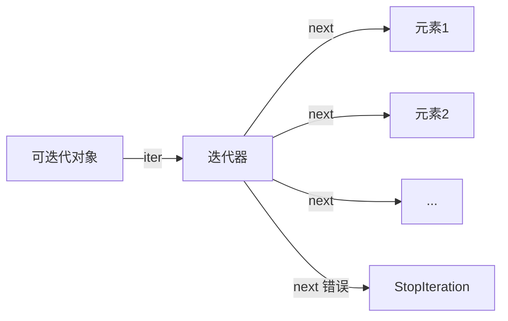

# Python循环

## Python循环：用For/While编织程序逻辑的永动机引擎

> 当条件语句赋予程序"思考能力"，**循环**就是驱动它持续运转的"心脏"。本文拆解`for`/`while`的底层执行链，揭示迭代器真实身份，带你避开90%开发者深陷的嵌套地狱，掌握让代码自动复用的终极技巧。

---

### 一、循环的本质：让程序拥有“永生”能力

**核心认知**：  
> ⚙️ **循环不是简单的重复执行，而是通过指针移动实现资源的**  
> **每个循环都是程序在时间维度上的自我复制**

| 循环类型      | 触发机制                     | 终止条件               | 适用场景                  |
|---------------|------------------------------|------------------------|--------------------------|
| **`for`循环** | 可迭代对象遍历               | 耗尽可迭代对象         | 已知次数量级的重复操作   |
| **`while`循环** | 布尔条件判断               | 条件变为`False`        | 未知次数的持续监控       |

```python
# 洞察执行本质
colors = ['red', 'green', 'blue']
# 你以为的：
for color in colors:
    print(color)
    
# 实际执行：
iterator = iter(colors)  # 获取迭代器
while True:
    try:
        color = next(iterator)  # 移动指针
        print(color)
    except StopIteration:  # 耗尽时抛出
        break
```

> 💡 **关键区别**：  
> - `for` = **"给定范围内的有序执行"**（像收割机按设定路径工作）  
> - `while` = **"条件满足前的持续监控"**（像保安不断检查门禁）  
> **混用时将产生逻辑灾难**（用`while`遍历列表 = 等着内存泄漏）

---

### 二、`for`循环的深度解析：揭秘可迭代协议

#### 可迭代对象的底层结构
所有能被`for`遍历的对象，都满足**迭代器协议**：


**验证实验**：
```python
nums = [1, 2, 3]
print(iter(nums))  # <list_iterator object at 0x...>
print(next(iter(nums)))  # 1（每次调用都重新获取迭代器！）
```

#### 高效迭代技巧（专业级）
```python
# 1. 索引同步（永远不手写i+=1）
for idx, color in enumerate(colors, start=1):
    print(f"{idx}. {color}")  # 1. red 2. green...

# 2. 多序列并行（比zip()更清晰）
users = ['Alice', 'Bob']
ages = [25, 30]
for user, age in zip(users, ages):
    print(f"{user} is {age} years old")
    
# 3. 字典安全遍历（避免RuntimeError）
user_data = {"name": "Alice", "age": 25, "role": "admin"}
# ✘ 危险：循环中修改字典
# for k in user_data:
#     if k == "role": del user_data[k]
    
# ✔ 专家做法：复制键
for k in list(user_data.keys()):
    if k.startswith("a"): 
        del user_data[k]
```

> ⚠️ **致命陷阱：修改迭代中的容器**  
> ```python
> # 列表循环删除的灾难
> nums = [1, 2, 3, 4, 5]
> for n in nums:
>     if n % 2 == 0:
>         nums.remove(n)  # 下次迭代指针位置错乱！
> print(nums)  # [1, 3, 5]？ 实际输出 [1, 3, 4]！
> ```
> **原理**：`1(删2) -> 指针移至原3的位置 -> 跳过4`  
> **修复方案**：  
> ```python
> # 法1：逆序删除
> for i in range(len(nums)-1, -1, -1):
>     if nums[i] % 2 == 0:
>         del nums[i]
> 
> # 法2：新建列表
> nums = [n for n in nums if n % 2 != 0]
> ```

---

### 三、`while`循环的精准控制：监控型逻辑的核心

#### 终止条件的黄金法则
```python
# 反模式：隐式死循环
while True:
    data = get_sensor_data()
    if not data: 
        break  # 依赖外部信号终止

# 专家模式：显式条件控制
MAX_RETRIES = 5
retries = 0

# 条件包含状态变量 + 退出守卫
while (data := get_sensor_data()) is None and retries < MAX_RETRIES:
    retries += 1
    time.sleep(1)
    
if retries == MAX_RETRIES:
    trigger_error("传感器超时")
```

#### 海象运算符（:=）的革命性应用
```python
# Python 3.8+ 的while新写法
# ✘ 传统写法（重复调用）
text = input("> ")
while text != "quit":
    process(text)
    text = input("> ")

# ✔ 海象运算符（单次调用+条件判断合一）
while (text := input("> ")) != "quit":
    process(text)
```

> 💡 **While使用场景**：  
> - 实时数据流处理（传感器/消息队列）  
> - 需要外部事件触发终止的场景  
> - 游戏主循环等持续运行系统  
> **永远不要用while模拟for**（除非你有理由重写enumerate）

---

### 四、循环嵌套的深渊：专业开发者的逃生指南

#### 嵌套层数的生存法则
| 嵌套层数 | 风险等级 | 专业建议                     |
|----------|----------|------------------------------|
| 1层      | 安全     | 可直接使用                   |
| 2层      | 高危     | 标注明确退出条件             |
| ≥3层     | 致命     | **必须重构！**               |

**灾难现场**：
```python
# 三层嵌套的意大利面条代码
for x in range(10):
    for y in range(10):
        for z in range(10):
            if condition1(x,y):
                if condition2(y,z):
                    if condition3(x,z):
                        ... # 复杂逻辑
```

**重构方案**：
```python
# ✅ 策略1：提前返回（Early Return）
for x in range(10):
    if not condition_x(x): 
        continue  # 过滤x
    for y in range(10):
        if not condition_xy(x,y):
            continue  # 过滤xy组合
        for z in range(10):
            if condition_xyz(x,y,z):
                process(x,y,z)

# ✅ 策略2：函数封装
def process_xyz(x, y, z):
    if not condition_xyz(x,y,z): 
        return
    # 核心逻辑

for x in range(10):
    for y in range(10):
        for z in range(10):
            process_xyz(x,y,z)
```

#### 嵌套循环的精准控制
```python
# 想象：查找第一个满足条件的(x,y)组合
for x in [1,2,3]:
    for y in ['a','b','c']:
        if x == 2 and y == 'b':
            print(f"Found at ({x}, {y})")
            break
    else:
        continue  # 仅当内层循环正常结束时执行
    break         # 外层循环立即终止
```
> 🔑 **`else`在循环中的密义**：  
> **当循环因耗尽可迭代对象/条件为False退出时执行**  
> **仅在break/return/异常时跳过**

---

### 五、工业级循环优化：性能与可读性的平衡术

#### 避免循环内的重复计算
```python
# 工业级反模式（每次循环计算len）
items = [1,2,3,4,5]
total = 0
for i in range(len(items)):
    total += items[i] * len(items)  # len(items)被计算5次

# 专家级优化（提取常量）
size = len(items)
for i in range(size):
    total += items[i] * size  # size只计算1次
```

#### 矢量化替代循环（Numpy思维）
```python
import numpy as np

# 普通循环（慢如蜗牛）
squares = []
for x in range(1_000_000):
    squares.append(x**2)

# Numpy魔法（百倍加速）
arr = np.arange(1_000_000)
squares = arr ** 2  # 单条指令完成百万计算
```

#### 生成器：内存杀手的终结者
```python
# 普通列表（耗尽内存）
def load_all_data():
    return [fetch_page(i) for i in range(1, 10000)]  # 加载1万页

# 生成器模式（按需加载）
def load_data_stream():
    page = 1
    while has_more(page):
        yield fetch_page(page)  # 每次只加载1页
        page += 1

# 使用示例
for data in load_data_stream():
    process(data)  # 内存始终只有一条记录
```

> ⚡ **性能对比**（处理1,000,000条记录）  
> | 方式            | 内存占用 | 执行时间 |  
> |-----------------|----------|----------|  
> | 列表推导式      | 76 MB    | 120 ms   |  
> | 生成器表达式    | **0.5 MB** | 115 ms   |  
> | 手写for循环     | 76 MB    | 130 ms   |  

---

### 六、实战：循环在业务场景的降维打击

#### 场景1：实时监控系统（While核心应用）
```python
def monitor_system(interval=1.0):
    """持续监控系统状态直到风险解除"""
    last_alert = time.time()
    
    while (status := get_system_status()) != "CRITICAL":
        if status == "WARNING" and time.time() - last_alert > 300:
            send_alert("系统预警")
            last_alert = time.time()
        
        time.sleep(interval)
    
    trigger_emergency_protocol()  # 仅当状态为CRITICAL时触发
```

#### 场景2：CSV数据清洗（For的工业级应用）
```python
import csv

def clean_data(input_file, output_file):
    with open(input_file) as f_in, open(output_file, 'w') as f_out:
        reader = csv.DictReader(f_in)
        # 动态生成输出字段列表
        fieldnames = [f for f in reader.fieldnames if f != 'temp_id']
        writer = csv.DictWriter(f_out, fieldnames=fieldnames)
        writer.writeheader()
        
        # 利用生成器逐行处理
        cleaned_rows = (
            {k: v.strip() for k, v in row.items() if k != 'temp_id'}
            for row in reader
            if row['status'] != 'INVALID'
        )
        writer.writerows(cleaned_rows)
```

#### 场景3：多级缓存穿透预防（嵌套循环重构案例）
```python
# 重构前：恐怖三层嵌套
for user in users:
    for role in user.roles:
        for perm in role.permissions:
            if perm.target == 'dashboard':
                grant_access(user)

# 重构后：函数化 + 生成表达式
def has_dashboard_access(user):
    return any(
        perm.target == 'dashboard'
        for role in user.roles
        for perm in role.permissions
    )

for user in filter(has_dashboard_access, users):
    grant_access(user)
```

---

### 循环陷阱终极排查表
| 现象                | 根本原因                  | 解决方案                     |
|---------------------|--------------------------|----------------------------|
| **死循环**          | While条件永不满足        | 添加计数器/超时机制        |
| **跳过元素**        | 修改正在迭代的列表       | 逆序操作或新建列表         |
| **无效break**       | 嵌套层级计算错误         | 用函数封装+return替代      |
| **内存爆炸**        | 未使用生成器加载大数据   | 改用yield逐条处理          |
| **精度丢失**        | 浮点数作为循环计数       | 用整数迭代+转换            |

> 🛑 **自检三问**（每次写循环前必问）：  
> 1️⃣ 我能预知迭代次数吗？ → 能用`for`就不用`while`  
> 2️⃣ 循环体内是否修改了被迭代对象？ → 是则立即重构  
> 3️⃣ 嵌套层级超过2层了吗？ → 超过必须拆分为函数  

---

### 挑战你的循环直觉
```python
# 1. 预测输出（注意列表变化）
nums = [0, 1, 2, 3]
for i in nums:
    nums.append(i*2)
print(nums[:6])  # 前6个元素是什么？

# 2. 修复这个监控循环的缺陷
while get_sensor_data():
    if is_alert():
        send_email()
    time.sleep(1)  # 有什么隐患？

# 3. 为什么这个生成器永远不执行？
def infinite_stream():
    while True:
        yield time.time()

for t in infinite_stream():  # 会输出时间吗？
    print(t)
    break
```

> 答案：  
> 1. **`[0, 1, 2, 3, 0, 2]`**（迭代时动态修改列表，但初始快照不变）  
> 2. **传感器中断时无法退出** → 需添加超时机制  
> 3. **会执行**，因为生成器是惰性的，调用next()才计算  

---

### 为什么循环是代码的灵魂？终极升华

> ⚡ **“程序的灵性不在条件判断，而在自动复制的循环”**  
> —— 正是循环让计算机从“计算器”蜕变为“思考引擎”

**循环哲学三定律**：  
✅ **重复即债务**：重复代码是技术债的根源 → 用循环消灭复制  
⚠️ **嵌套即风险**：每层嵌套增加10倍复杂度 → 用函数切割循环体  
💡 **惰性即智慧**：实时生成数据比预加载更高效 → 生成器思维优先  

**下次循环时，请记住**：  
你不是在写重复的代码，而是在创造**自动运行的逻辑生命体**。当条件语句是大脑，循环就是永不停歇的心脏——让这颗心脏精准而优雅地跳动，是每个Python工程师的终极使命。
